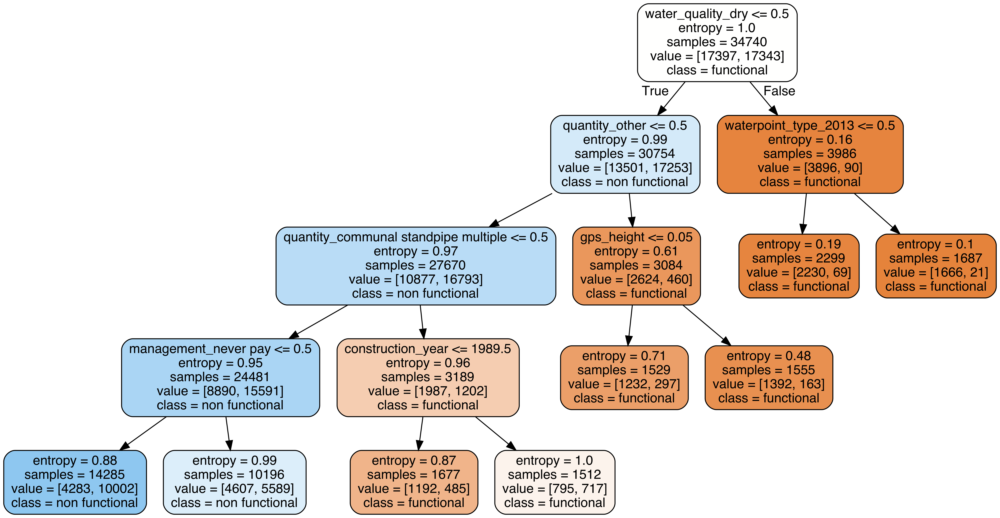

# Water Enhancment Project

## Premise: 

Aqua partners is a public sector consulting firm which helps governments improve water access for their populations. This project is done in cooperation with the Government of Tanzania and the minister of water and irigation. 

## Data & Objective:

We are using a dataset containing all the existing water pumps in the country. Associated with each water pump is a series of features such as: Date of installation / Water quality / Region / Installing Organisation / Source type / Nearest water bassin
Length of operation. We are aiming to use classification algorithms to evaluate the features that determine whether a water pump works or not. Provided the classification yields high predictive performance we will be able to recommend to the Tanazanian government which features drive the usability of a water pump. This will also enable them to select and evaluate more carefully third parties who install water pumps (World Bank, Anglican Church, Charities). 

## Data Structure, Selection & Transformation:

The raw dataset contains 60,000 water pumps and 41 different features. Combining feature selection and engineering we reduced the dataset to 29 features prior to binary transformation. We are using Functional / Non-Functional as our target. We made some additional small features changes to simplify the dataset detailed in the Main jupyter notebook. We used undersamping to fix class imbalance across the existing set of water pumps to avoid overfitting. Our end dataset contains 869 features after binary transformation. 

Train-Test split: 80/20 
K-fold cross validation: 5 folds / stratified random sampling

## Modeling

Model Scoring measures: Accuracy & ROC_AUC

Baseline Model (Train / Validation): 
           - Decision Tree: 0.90 / 0.77

Secondary Models (Train / Validation): 
          - Logistic Regression: 0.78 / 0.77 
          
          - Random Forest: 0.77 / 0.76
          
          - Support Vector Machines: 0.50 / 0.49
          
          - K-nearest-neighbors: 0.68 / 
          
          - Ensemble Methods: 
              - Decision Tree w/ Bagging: 0.90 / 0.86
              
              - Logistic Regression w/ Bagging: 0.78 / 0.77

## Selection

## Interpretation 
